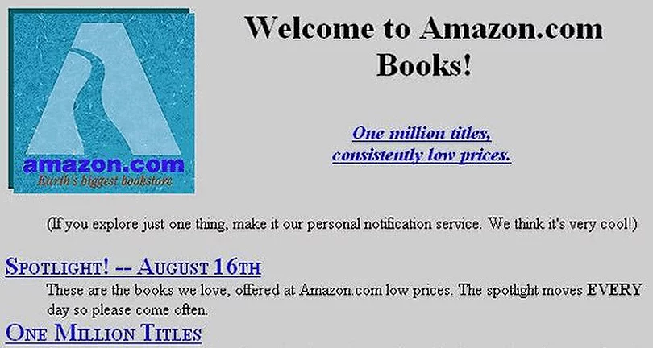
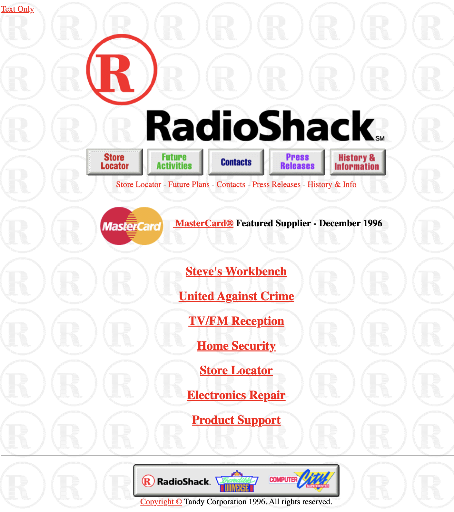

# Radio Shack Redo

## Learning Goals

  * Become aquainted with the history of web design
  * Learn to use modern web development tools

## Background

The world wide web as we know it has only been around since the mid 1990's. Early tools to develop websites were very limited: there was no CSS or JavaScript and HTML was rendered differently on different browsers. One of the earliest sites was amazon.com.



Quite a different look than today!

Another early site was RadioShack. Their first website in 1996 had a look very similar to websites of that time. The hottest design elements were clunky looking fake buttons (with no animations that didn't even indicate they were rolled over or clicked on!) and repeating background patterns.



A common feature on early sites was a link for a "text only" version of the web page, because internet connections were so slow, images could be very slow to load! The oversized RadioShack logo and buttons is actually one image here, and the buttons are activated using an html `map` feature, which is still available today, but rarely used.

```html
<map name="rsmap">
<area shape="rect" coords="8,246,122,297" href="http://www.radioshack.com/rsstorelocator/rszip?1">
<area shape="rect" coords="123,246,240,297" href="http://www.radioshack.com/rsfuture.html">
<area shape="rect" coords="241,246,358,297" href="http://www.tandy.com/contacts/">
<area shape="rect" coords="359,246,475,297" href="http://www.tandy.com/press.html">
<area shape="rect" coords="476,246,599,297" href="http://www.radioshack.com/history/">
</map>
```
There was no control over typography and the only fonts available were those that resided on your computer. So a web designer had to be careful to use only very common standard fonts, since the user would need them installed as well to render the page in the desired format.

By 1997, RadioShack significantly upgraded the look of their site, and it now looked like this. Note the 3-D spinning "R", another popular feature on websites of that time!


To create a layout like this with columns and rows, the entire page is constructed from an html table, with a 1 by 1 pixel image, `dot_clear.gif`, to control the visual layout of HTML elements on a web page, since the HTML standard at the time did not allow this. Tables were not created for this purpose, but designers had few options for controling the layout of the page.

```html
<table border="0" cellspacing="0" cellpadding="0" width="969"><tr valign="top" align="left">
	<td colspan="1" width="10"></td>
	<td colspan="1" width="2"></td>
	<td colspan="1" width="35"></td
 ...
 ```
Since there was still limited choices for fonts, all of the type you see on this page that is not the standard "Times Roman" was created as an image and imported into the web page.
 
[Take a look at some other website designs from the 90's.](https://www.justinmind.com/blog/10-90s-websites-designs-you-wont-believe-existed/)

Now that you have your honorary web design degree behind you, you will re-design RadioShack's website (just the homepage is fine!) using modern web development tools! (No tables, html maps or spinning logos please!)

## Getting Started

1. Log into [code.cs50.io](https://code.cs50.io/) using your GitHub account. 
2. Click inside the terminal window and execute `cd`.
3. Then copy and paste `wget https://cdn.cs50.net/2022/fall/labs/8/radioshack.zip` into your terminal to download this lab's distribution code.
4. At the `$` prompt, type `unzip radioshack.zip`.
5. You no longer need the ZIP file, so execute `rm radioshack.zip` and respond `y` at the prompt.
6. Now type `cd radioshack` to move into that directory.
7. If you now type `ls` you will see two folders, one containing files for the 1996 version of the RadioShack homepage, and the other the 1997 version.
8. `cd` into each of these folders, execute `http-server` in the terminal, click on `index.html` and take a look at how these pages render.
9. Feel free to look through the html files in each to see how they were created.
10. Now create your own RadioShack homepage using HTML5, CSS3 and Bootstrap 5.
11. Starter code is included in the radiotoday folder.


## Implementation Details

One of the most popular front-end web development tools in use these days is [Bootstrap](https://getbootstrap.com/docs/5.2/getting-started/introduction/). It's free, open-source, and designed to enable [responsive](https://www.techtarget.com/whatis/definition/responsive-design) development of websites and web apps. It's built on top of CSS and JavaScript to allow developers to create websites quickly and without having to recreate commonly used features such as interactive buttons, navigation systems, columns and grids.

Start your redesign by trying out bootstrap's [Navbar](https://getbootstrap.com/docs/5.2/components/navbar/) feature to easily create a custom navigation bar to handle all the menu options. Scoll down on this bootstrap documentation until you see a simple navigation bar with minimal code and copy this code to the top of the `body` section of `index.html`.

```html
<nav class="navbar navbar-expand-lg bg-light">
  <div class="container-fluid">
    <a class="navbar-brand" href="#">Navbar</a>
    <button class="navbar-toggler" type="button" data-bs-toggle="collapse" data-bs-target="#navbarNavAltMarkup" aria-controls="navbarNavAltMarkup" aria-expanded="false" aria-label="Toggle navigation">
      <span class="navbar-toggler-icon"></span>
    </button>
    <div class="collapse navbar-collapse" id="navbarNavAltMarkup">
      <div class="navbar-nav">
        <a class="nav-link active" aria-current="page" href="#">Home</a>
        <a class="nav-link" href="#">Features</a>
        <a class="nav-link" href="#">Pricing</a>
        <a class="nav-link disabled">Disabled</a>
      </div>
    </div>
  </div>
</nav>
```

When you run `http-server` to preview your web page, you'll see menu items on top such as "Features", "Pricing", etc. Change these to represent the appropriate menu items for your RadioShack homepage. You don't need to create additional pages for these to link to, but if you did, you would change `href=#` in each of these menu items to link to the appropriage html pages.

Next, take a look at other bootstrap features. Check out how to [create columns](https://getbootstrap.com/docs/5.2/layout/columns/) without using tables as was done in the 90's. 

You may want to take a look at how to create [responsive images](https://getbootstrap.com/docs/5.2/content/images/) that shrink and expand as the page size changes so they look good on any size device.

And while you are thinking about images for your homepage, check out how to create a [carousel](https://getbootstrap.com/docs/5.2/components/carousel/) to automatically cycle through more than one image.

You are the designer, the design here is up to you. Have fun and see what you can create! A more recent RadioShack logo is included if you want to use it.

## Thought Question

	* Why do you think so many designers use Bootstrap, rather than creating their own CSS?
	
## How to Test Your Code

No `check50` for this assignment! To ensure that the code on your pages is valid, you can use this [Markup Validation Service](https://validator.w3.org/#validate_by_input), copying and pasting your HTML directly into the provided text box.

## How to Submit

In your terminal, cd into the `radionow` folder and execute the below to submit your work.

```
submit50 cs50/labs/2022/fall/radioshack
```

